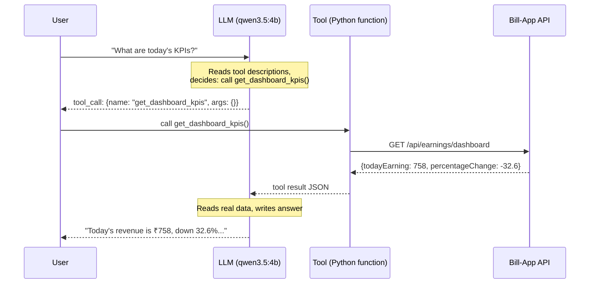
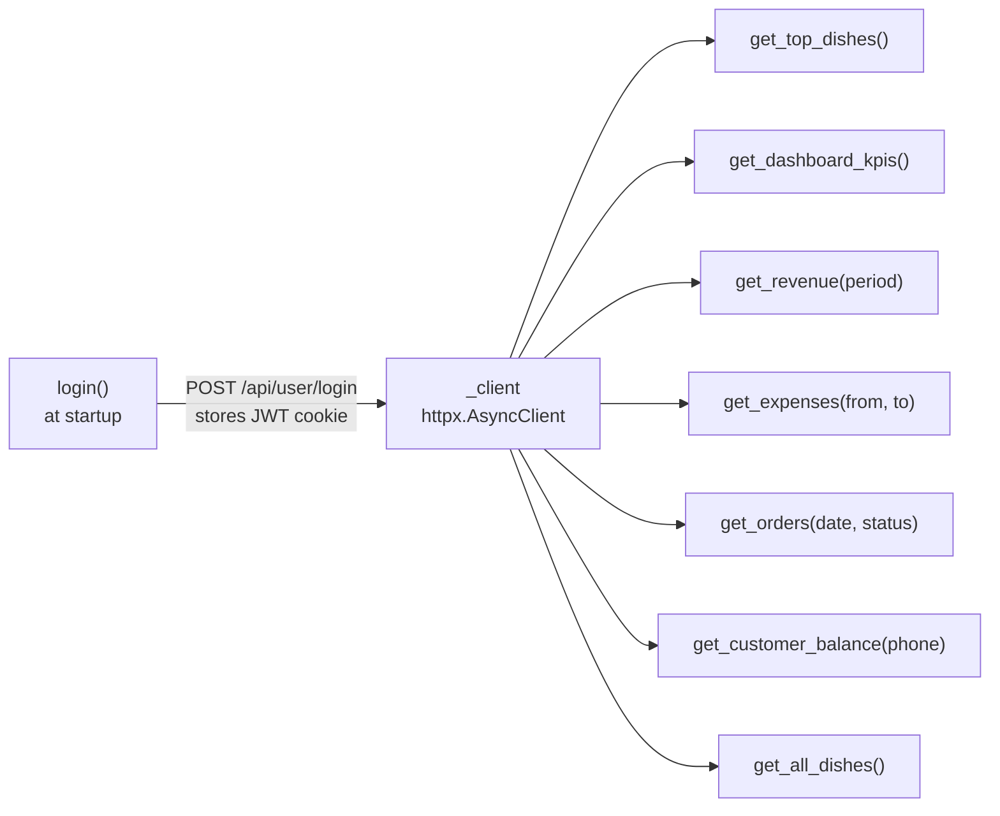
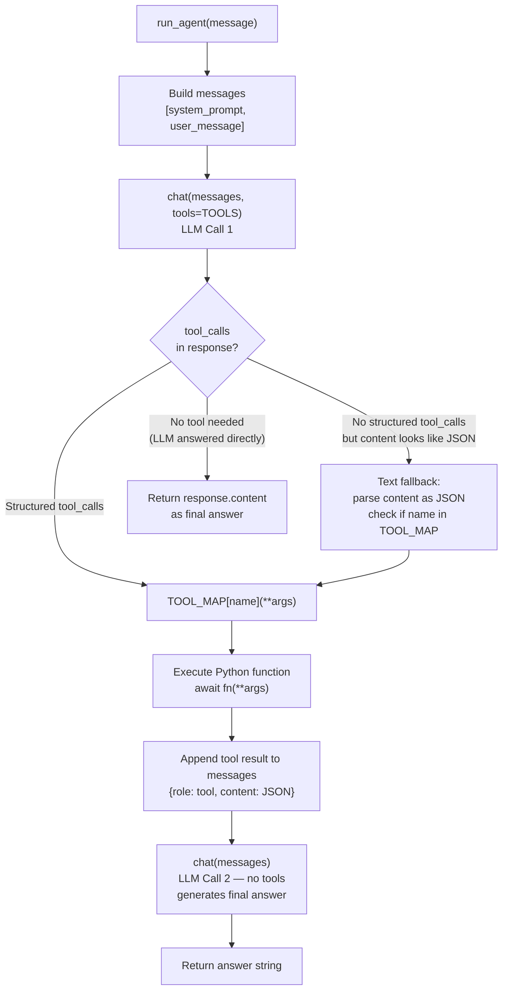
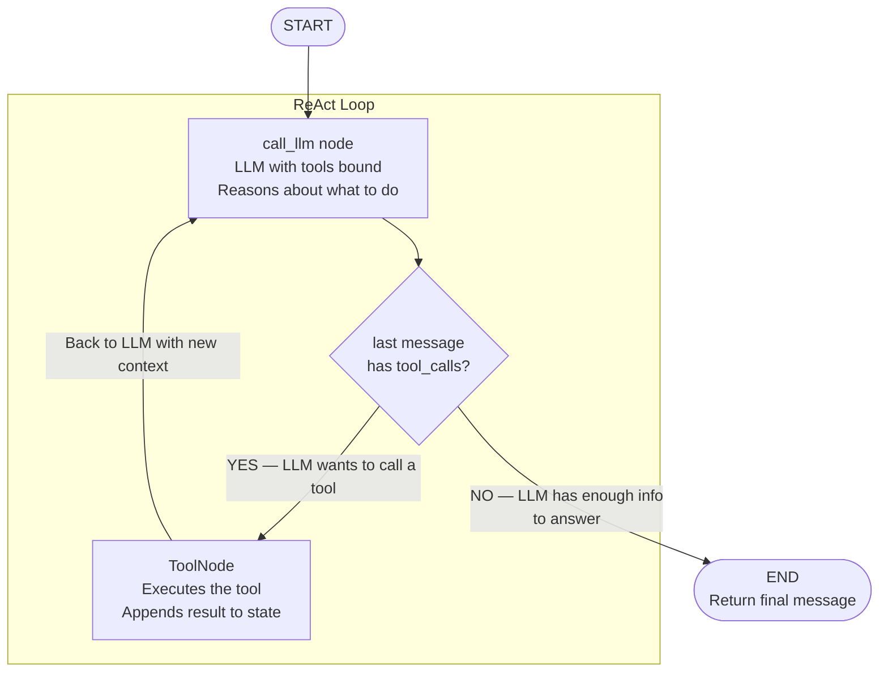
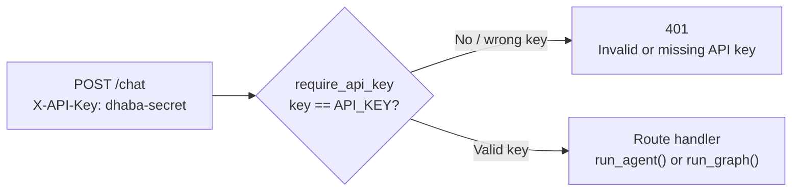
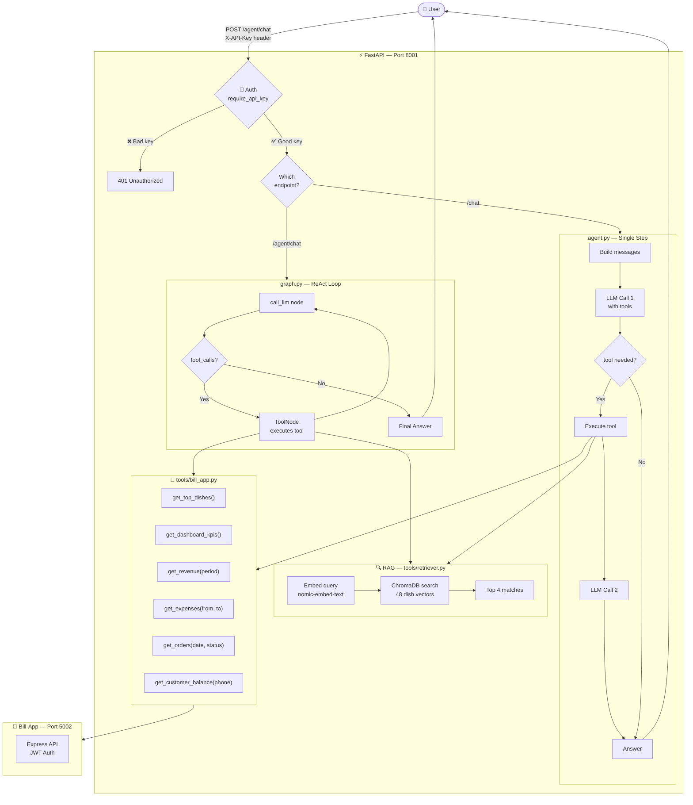
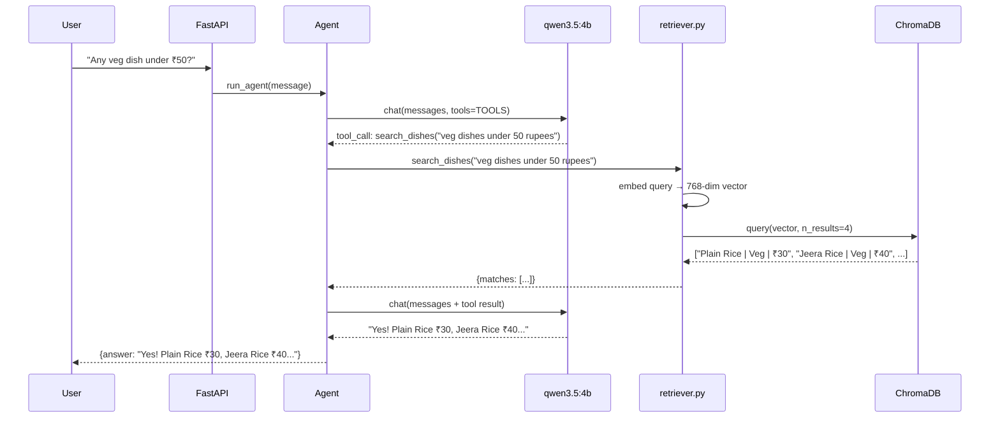
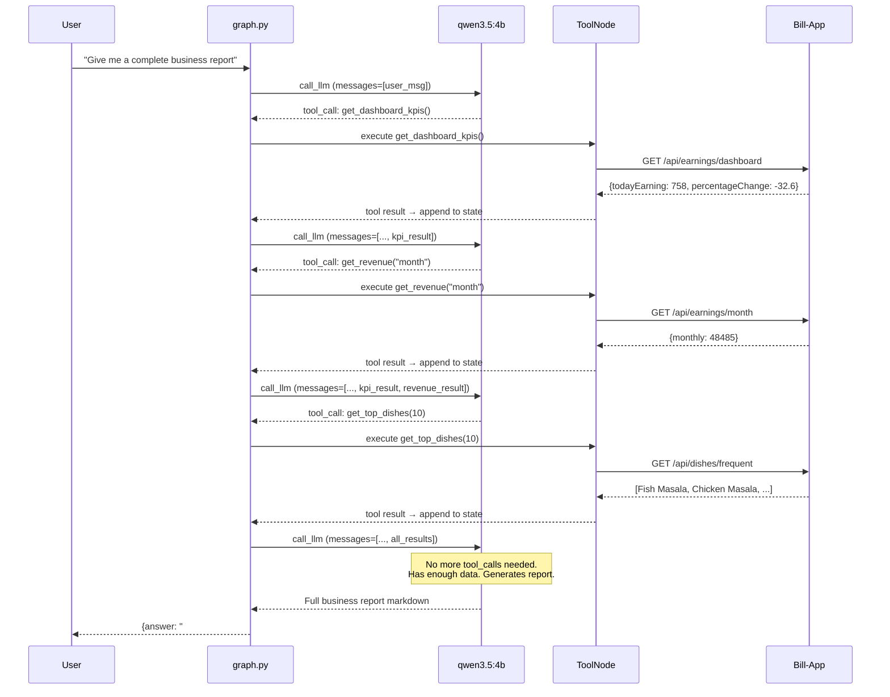
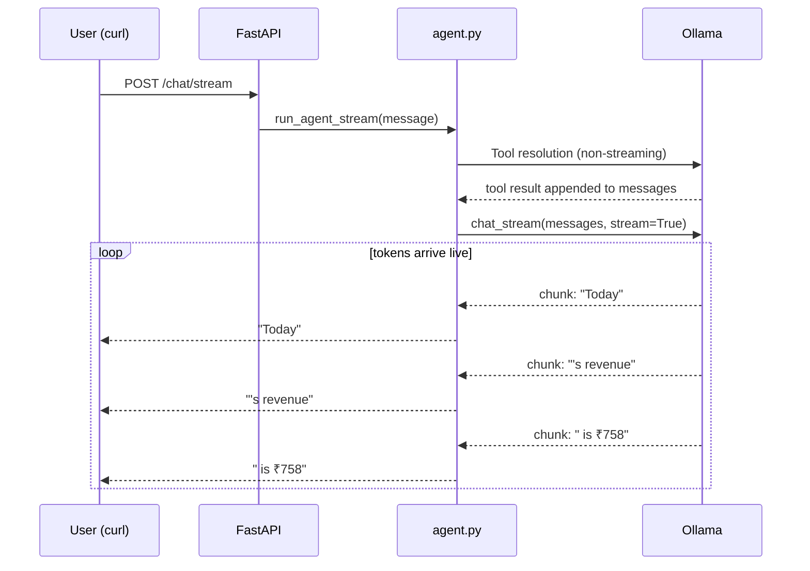

# Dhaba AI — Complete Learning Guide

> Everything built, how it works, why it exists, and how it fits together.
> Read this top to bottom to understand the full system.

---

## Table of Contents

1. [What We Built](#1-what-we-built)
2. [Tech Stack](#2-tech-stack)
3. [File Structure](#3-file-structure)
4. [Core Concept: How LLMs Use Tools](#4-core-concept-how-llms-use-tools)
5. [Layer 1 — LLM Client (llm.py)](#5-layer-1--llm-client-llmpy)
6. [Layer 2 — Tools](#6-layer-2--tools)
7. [Layer 3 — RAG Pipeline](#7-layer-3--rag-pipeline)
8. [Layer 4 — Agent (agent.py)](#8-layer-4--agent-agentpy)
9. [Layer 5 — LangGraph Agent (graph.py)](#9-layer-5--langgraph-agent-graphpy)
10. [Layer 6 — API Server (main.py)](#10-layer-6--api-server-mainpy)
11. [Complete System Flow Diagrams](#11-complete-system-flow-diagrams)
12. [Eval Results](#12-eval-results)
13. [Key Concepts Explained](#13-key-concepts-explained)

---

## 1. What We Built

A production-grade AI layer on top of a real dhaba (Indian restaurant) POS system called **Bill-App**.

The AI can:
- Answer menu questions semantically ("any veg dish under ₹50?")
- Report business KPIs, revenue, expenses, orders
- Check customer balances
- Generate multi-tool business reports
- Stream responses token by token
- Reject unauthorised requests

**Two agents running side by side:**

| Endpoint | Agent | Best for |
|----------|-------|---------|
| `POST /chat` | Simple agent (`agent.py`) | Single-step questions |
| `POST /agent/chat` | LangGraph agent (`graph.py`) | Complex multi-step queries |

---

## 2. Tech Stack

| Tool | What it does | JS Equivalent |
|------|-------------|---------------|
| **FastAPI** | Web framework, serves HTTP | Express.js |
| **Uvicorn** | ASGI server that runs FastAPI | Node.js runtime |
| **Pydantic** | Request/response validation | Zod / TypeScript types |
| **httpx** | Async HTTP client (calls Bill-App) | axios |
| **OpenAI SDK** | Talks to LLM (Ollama or OpenAI) | fetch to OpenAI API |
| **Ollama** | Runs LLM locally (qwen3.5:4b) | Local model server |
| **ChromaDB** | Vector database for dish embeddings | Like Redis but for semantic search |
| **LangGraph** | State machine for multi-step agents | XState |
| **LangChain** | LLM tool wrappers for LangGraph | Helper library |
| **python-dotenv** | Reads `.env` file | dotenv |

---

## 3. File Structure

```
dhaba-ai/
├── .env                  # Secrets — API keys, URLs, model name
├── config.py             # Reads .env, exports constants
├── llm.py                # Raw LLM calls — chat() and chat_stream()
├── agent.py              # Simple single-step agent
├── graph.py              # LangGraph multi-step agent
├── main.py               # FastAPI server — all HTTP routes
├── requirements.txt      # Python dependencies
├── chroma_db/            # ChromaDB files (auto-generated, 48 dish vectors)
│
├── tools/
│   ├── __init__.py
│   ├── bill_app.py       # Async functions calling Bill-App Express API
│   ├── definitions.py    # Tool schemas — tells LLM what tools exist
│   ├── embedder.py       # One-time script: embeds all dishes into ChromaDB
│   ├── retriever.py      # Semantic search over ChromaDB
│   └── lc_tools.py       # LangChain-format tool wrappers (for LangGraph)
│
└── evals/
    ├── questions.json    # 20 test questions + expected topics
    ├── run.py            # Runs agent on all 20 questions, saves results
    ├── results.json      # Auto-generated answers from the agent
    └── score.py          # LLM judge scores each answer 1–5
```

---

## 4. Core Concept: How LLMs Use Tools

Before reading the code, understand this mental model.

**Without tools:** User asks → LLM guesses from training data → often wrong for real-time data.

**With tools:** User asks → LLM decides which function to call → we run the function → LLM reads the result → gives accurate answer.



**JS equivalent:**
```js
// Tool calling is like React query + AI deciding which query to run
const tools = {
  getKPIs: () => fetch('/api/earnings/dashboard').then(r => r.json()),
  getTopDishes: (limit) => fetch(`/api/dishes/frequent?limit=${limit}`).then(r => r.json()),
}
// LLM picks a key from `tools`, we call it, pass result back to LLM
```

---

## 5. Layer 1 — LLM Client (`llm.py`)

**What it is:** The lowest layer. Two async functions that talk to the LLM.

```python
from openai import AsyncOpenAI
from config import OPENAI_API_KEY, OPENAI_BASE_URL, LLM_MODEL

client = AsyncOpenAI(api_key=OPENAI_API_KEY, base_url=OPENAI_BASE_URL)

async def chat(messages, tools=None):
    response = await client.chat.completions.create(
        model=LLM_MODEL, messages=messages, tools=tools
    )
    return response.choices[0].message

async def chat_stream(messages):          # async generator
    stream = await client.chat.completions.create(
        model=LLM_MODEL, messages=messages, stream=True
    )
    async for chunk in stream:
        token = chunk.choices[0].delta.content
        if token:
            yield token                   # yields one token at a time
```

**Key design:** `OPENAI_BASE_URL` in `.env` is set to `http://localhost:11434/v1` (Ollama). Change it to `https://api.openai.com/v1` + real API key = switch to GPT. **Same code, different `.env`.**

**`chat_stream` is an async generator** — JS equivalent:
```js
async function* chatStream(messages) {
  for await (const chunk of stream) {
    yield chunk.choices[0].delta.content
  }
}
```

---

## 6. Layer 2 — Tools

### 6a. `tools/bill_app.py` — API Functions

One shared `httpx.AsyncClient` holds the JWT cookie after login. All tool functions reuse it.



**JS equivalent:** Like `axios.create({ baseURL, withCredentials: true })` — one instance, cookies shared.

### 6b. `tools/definitions.py` — Tool Schemas

**Critical:** The LLM never sees your Python functions. It only sees these JSON schemas. The description is what makes the LLM choose the right tool.

```python
{
    "type": "function",
    "function": {
        "name": "get_revenue",
        "description": "Get revenue for a time period. period must be: 'day', 'week', 'month', or 'year'.",
        "parameters": {
            "type": "object",
            "properties": {
                "period": {
                    "type": "string",
                    "description": "Time period: 'day', 'week', 'month', or 'year'",
                }
            }
        }
    }
}
```

**Rule:** Wrong description → LLM passes wrong args → tool fails. This is why `"monthly"` broke `get_revenue` — description said `monthly`, API expected `month`.

---

## 7. Layer 3 — RAG Pipeline

**Problem RAG solves:** "Any veg dish under ₹50?" — no API endpoint for this. Tool calling can't answer it. Need semantic search.

**RAG = Retrieval Augmented Generation.** Store knowledge as vectors → search by meaning → give to LLM as context.

### How Embeddings Work

Text → numbers (vectors). Similar meaning = similar numbers = close in vector space.

```
"spicy chicken curry"   → [0.12, -0.45, 0.87, ...]  (768 numbers)
"hot non-veg sabji"     → [0.11, -0.43, 0.85, ...]  ← close! similar meaning
"plain rice"            → [0.91,  0.23, -0.12, ...] ← far away, different meaning
```

**JS equivalent:** Like a search index but fuzzy — finds "Fish Masala" when you search "spicy seafood curry."

### RAG Architecture

```mermaid
flowchart TD
    subgraph Setup["One-time Setup (embedder.py)"]
        BA["Bill-App\nGET /api/dishes"] -->|"48 dishes"| DishText
        DishText["_dish_to_text()\nFish Masala | Non-Veg | Sabji | Half:₹100, Full:₹200"] --> Embed1
        Embed1["nomic-embed-text\nvia Ollama"] -->|"768-dim vector"| Chroma
        Chroma[("ChromaDB\n./chroma_db/\n48 vectors stored on disk")]
    end

    subgraph Runtime["Every Query (retriever.py)"]
        Query["User: 'veg dishes under ₹50'"] --> Embed2
        Embed2["nomic-embed-text\nembed the query"] -->|"query vector"| Search
        Search["ChromaDB\ncosine similarity search"] -->|"top 4 matches"| Results
        Results["Plain Rice | Veg | ₹30\nJeera Rice | Veg | ₹40\nChawal Dal | Veg | ₹40\nMasala Rice | Veg | ₹50"] --> LLM
        LLM["LLM answers\nwith this context"]
    end
```



### Key Files

**`tools/embedder.py`** — Run once to populate ChromaDB:
```python
async def embed_menu():
    dishes = await get_all_dishes()          # fetch 48 dishes from Bill-App
    for dish in dishes:
        text = _dish_to_text(dish)           # convert to searchable string
        embedding = _embed(text)             # 768 numbers via nomic-embed-text
        collection.add(text, embedding)      # store in ChromaDB on disk
```

**`tools/retriever.py`** — Called on every menu question:
```python
async def search_dishes(query, n_results=4):
    query_vec = _embed(query)                # embed the user's question
    results = collection.query(query_vec)    # find closest dish vectors
    return {"matches": results["documents"]} # return matching dish texts
```

---

## 8. Layer 4 — Agent (`agent.py`)

**What it is:** Single-step agent. One tool call per question, then generates answer.



**The text fallback** is a real production pattern. Some Ollama models (like hermes-fast) output tool calls as plain JSON text instead of structured `tool_calls`. The agent handles both:

```python
# Structured (OpenAI-compatible models)
tool_calls = response.tool_calls  # [ToolCall(function=Function(name='get_revenue', ...))]

# Text fallback (some Ollama models)
parsed = json.loads(response.content)  # {"name": "get_revenue", "arguments": {"period": "day"}}
```

**Streaming:** `run_agent_stream()` does the same tool resolution, then streams the final answer token by token via `chat_stream()`.

---

## 9. Layer 5 — LangGraph Agent (`graph.py`)

**Upgrade over agent.py:** Can call multiple tools in sequence before answering. Loops until done.

### Why LangGraph?

| | Simple Agent | LangGraph Agent |
|--|-------------|-----------------|
| Tool calls per question | 1 | Many (loops) |
| Memory | None | Full message history |
| "Business report" query | Partial (one tool) | Complete (all tools) |
| Mental model | Function | State machine |

### The ReAct Loop

**ReAct = Reason + Act.** LLM reasons about what to do → acts (calls tool) → observes result → reasons again → acts again → until done.



### State = Message History

`MessagesState` is just a list of messages that grows as the loop runs:

```
[user: "business report"]
→ [user msg, assistant: tool_call(get_kpis)]
→ [user msg, assistant: tool_call, tool: kpi result]
→ [user msg, assistant: tool_call, tool: kpi result, assistant: tool_call(get_revenue)]
→ [user msg, assistant: tool_call, tool: kpi result, assistant: tool_call, tool: revenue result]
→ [user msg, ..., assistant: "Here is the full business report..."]
```

**JS mental model:** Like Redux state — every action (tool call) adds to the state. LangGraph is the reducer.

### Code Structure

```python
# 1. LLM with tools bound — knows what tools it can call
_llm_with_tools = _llm.bind_tools(ALL_TOOLS)

# 2. Node: calls LLM, appends response to state
async def call_llm(state: MessagesState):
    response = await _llm_with_tools.ainvoke(state["messages"])
    return {"messages": [response]}

# 3. Edge condition: continue looping or end?
def should_continue(state: MessagesState) -> str:
    if state["messages"][-1].tool_calls:
        return "tools"    # loop back
    return END            # done

# 4. Graph wiring
workflow = StateGraph(MessagesState)
workflow.add_node("agent", call_llm)
workflow.add_node("tools", ToolNode(ALL_TOOLS))   # auto-executes any tool call
workflow.add_edge(START, "agent")
workflow.add_conditional_edges("agent", should_continue)  # branch
workflow.add_edge("tools", "agent")               # always loop back
graph = workflow.compile()
```

---

## 10. Layer 6 — API Server (`main.py`)

**What it is:** FastAPI server. Wires everything together into HTTP endpoints.

### Auth Middleware



**JS equivalent:** Express middleware `(req, res, next) => { if (!validKey) return res.status(401).json(...); next() }`

### All Routes

```
GET  /              → health check (public)
GET  /dishes/top    → top dishes (public)
GET  /kpis          → today's KPIs (public)
POST /chat          → simple agent — single tool (🔐 auth required)
POST /chat/stream   → streaming simple agent (🔐 auth required)
POST /agent/chat    → LangGraph multi-step agent (🔐 auth required)
```

### Startup: Login to Bill-App

```python
@asynccontextmanager
async def lifespan(app: FastAPI):
    await login()    # POST /api/user/login → stores JWT cookie in httpx client
    yield            # server runs
```

Login happens ONCE at startup. All subsequent tool calls reuse the cookie automatically. **Same pattern as browser login** — you log in once, cookie persists in every request.

---

## 11. Complete System Flow Diagrams

### Full Architecture



### Scenario 1: Menu Question (RAG path)



### Scenario 2: Business Report (LangGraph multi-tool path)



### Scenario 3: Streaming Response



---

## 12. Eval Results

20 questions, LLM judge scoring 1–5:

| Score | Count | Questions |
|-------|-------|-----------|
| ⭐⭐⭐⭐⭐ (5) | 9 | Veg dishes, top dishes, revenue, non-veg, rice, popular, cheapest, weekly earn |
| ⭐⭐⭐⭐ (4) | 5 | Business today, roti, drinks, egg dishes, snacks |
| ⭐⭐⭐ (3) | 6 | Biryani, Fish Masala price, yearly revenue, expenses, dal, expensive dish |

**Average: 4.1/5.0 ✅ Pass**

**Why 3-star questions scored lower:**
- Menu ranking questions (most expensive, cheapest) — RAG returns matches but can't sort across all 48 dishes
- Yearly revenue — API returned data but agent didn't format it clearly
- Expenses — response lacked context about what the numbers meant

**How to improve to 4.5+:**
- Add `get_all_dishes()` as a tool so LLM can rank/sort the entire menu
- Improve system prompt to add formatting instructions for financial data

---

## 13. Key Concepts Explained

### Tool Calling vs RAG — When to Use Which

| Question type | Use | Why |
|--------------|-----|-----|
| "What's today's revenue?" | Tool calling | Real-time data from API |
| "Any veg dishes?" | RAG | Semantic search over embedded menu |
| "Show me expenses" | Tool calling | Structured data from API |
| "Cheapest dish?" | RAG | Menu knowledge embedded in ChromaDB |
| "Business report?" | LangGraph (multiple tools) | Needs multiple API calls |

### Async/Await in Python

Same mental model as JavaScript:

```python
# Python
async def get_revenue(period):
    response = await _client.get(f"/api/earnings/{period}")
    return response.json()

# JavaScript equivalent
async function getRevenue(period) {
    const response = await fetch(`/api/earnings/${period}`)
    return response.json()
}
```

`asyncio.to_thread()` = running sync code without blocking (like `worker_threads` in Node).

### Vector Similarity Search

ChromaDB uses **cosine similarity** — measures the angle between two vectors.

- Score = 1.0 → identical meaning
- Score = 0.0 → completely unrelated

When you search "spicy non-veg curry", ChromaDB computes similarity against all 48 dish vectors and returns the 4 closest. This is why it finds "Fish Masala" even without exact keyword match.

### LangGraph State Machine

```
States:  [agent_node]  [tools_node]
Transitions:
  START         → agent_node
  agent_node    → tools_node    (if tool_calls in last message)
  agent_node    → END           (if no tool_calls — answer ready)
  tools_node    → agent_node    (always loop back)
```

**JS equivalent (XState):**
```js
const machine = createMachine({
  initial: 'agent',
  states: {
    agent: {
      on: { TOOL_NEEDED: 'tools', DONE: 'end' }
    },
    tools: {
      on: { COMPLETE: 'agent' }
    },
    end: { type: 'final' }
  }
})
```

### Why Two Agents?

`agent.py` (simple) and `graph.py` (LangGraph) coexist intentionally:

- Simple agent: faster, less overhead, good for 90% of questions
- LangGraph: slower (multiple LLM calls), better for complex multi-tool queries

In production you'd route: simple questions → simple agent, complex queries → LangGraph.

---

## Running the System

**Prerequisites:**
- Bill-App running on port 5002
- Ollama running (`ollama serve`)
- Model pulled (`ollama pull qwen3.5:4b` and `ollama pull nomic-embed-text`)

```bash
cd /Volumes/DevSSD/projects/ai-projects/dhaba-ai
source .venv/bin/activate

# One-time: embed the menu (if chroma_db/ doesn't exist)
python3 -m tools.embedder

# Start the server
uvicorn main:app --reload --port 8001
```

**Test endpoints:**
```bash
# Simple agent
curl -s -X POST http://localhost:8001/chat \
  -H "Content-Type: application/json" \
  -H "X-API-Key: dhaba-secret-key-2024" \
  -d '{"message": "top 3 dishes?"}' | python3 -c "import sys,json; print(json.load(sys.stdin)['answer'])"

# LangGraph multi-step agent
curl -s -X POST http://localhost:8001/agent/chat \
  -H "Content-Type: application/json" \
  -H "X-API-Key: dhaba-secret-key-2024" \
  -d '{"message": "Give me a business report"}' | python3 -c "import sys,json; print(json.load(sys.stdin)['answer'])"

# Re-run evals
python3 -m evals.run && python3 -m evals.score
```
